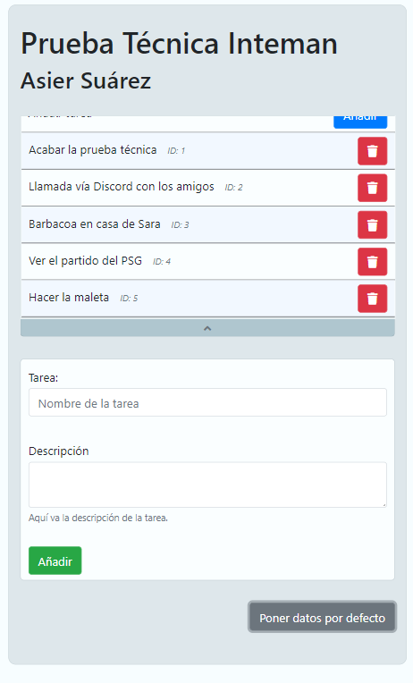

<!-- ABOUT THE PROJECT -->
## Sobre este repositorio

Este repositorio público es la prueba técnica que presento para aplicar al puesto de trabajo ofrecido por Inteman. Esta es una aplicación PHP que corre sobre el framework de Laravel. 

Esta aplicación tiene una única página donde ocurren todas sus funcionalidades. La página en ningún momento se recarga sino que actualiza sus datos dinámicamente para ofrecer una mejor y más fluida experiencia de usuario. A continuación se listan las características y operaciones que permite esta aplicación:

* Tiene un listado de tareas en el que se muestra el nombre y el ID de estas.
* Trae un formulario desde el que podremos crear tareas que se añadirán a la lista automáticamente.
* Pulsar una tarea del listado mostrará dicha tarea en el formulario, donde podremos ver su nombre y descripción.
* Este formulario permite editar o borrar las tareas que se hayan cargado en él.
* Desde la lista también podremos borrar las tareas pulsando sobre el botón de eliminar.
* Las tareas mostradas se guardan en una base de datos. Crear, modificar o borrar tareas actualiza en tiempo real la base de datos.
* Además, se añade un botón para reiniciar la base de datos y poner tareas por defecto.

### Librerias

Este proyecto no hubiera sido posible sin el uso de las siguientes librerías:

* [Laravel](https://laravel.com)
* [Livewire](https://laravel-livewire.com)
* [JQuery](https://jquery.com)
* [Bootstrap](https://getbootstrap.com)
* [FontAwesome](https://fontawesome.com)


<!-- GETTING STARTED -->
## Cómo instalar

Esta aplicación se instala como cualquier otra aplicación de Laravel que se clone desde GitHub. A continuación te listo las cosas que necesitas y como hacerlo.

### Prerequesitos

* Tener una insalación Apache2, PHP (7.4.11) y MySQL (5.7). Puedes usar WAMP, XAMPP o LAMP para hacerlo más sencillo.
* Tener Git instalado globalmente.
* Tener Composer instalado globalmente.

### Instalación

1. Ve a tu directorio web donde guardes tus proyectos (```/var/www/html/``` o ```C:\\xampp\htdocs\``` por ejemplo) y clona el repositorio con ```git clone https://github.com/Asier97/pruebaInteman.git```. Esto creará la carpeta ```pruebaInteman``` que contendrá el proyecto.
2. Copia ```.env.example``` a ```.env``` y modificar las siguientes claves:
 - ```APP_URL=``` la URL de la aplicación. Si la instalas local será ```http://localhost``` o ```http://127.0.0.1:8000``` si usas ```php artisan serve```
 - ```DB_HOST=127.0.0.1``` con tu host de BD. Si estás en local dejalo en ```127.0.0.1```
 - ```DB_PORT=3306``` con el puerto a tu BD. MySQL usa 3306 por defecto
 - ```DB_DATABASE=laravel``` el nombre de la base de datos que usarás
 - ```DB_USERNAME=root``` el nombre de su usuario
 - ```DB_PASSWORD=``` su contraseña
3. Usa ```composer install``` y ```composer update``` en una terminal en el directorio raíz de la aplicación.
4. En el archivo ```.env``` pon tu key o usa ```php artisan key:generate``` en el directorio raíz de la aplicación.
5. Crea la base de datos en tu servidor MySQL con el nombre que hayas puesto en el ```.env``` con cotejamiento ```utf8mb4_general_ci```.
6. Utiliza el comando ```php artisan migrate``` para migrar la tabla principal de tareas o ```php artisan migrate:fresh``` para migrar y refrescar la tabla.
7. Utiliza el comando ```php artisan db:seed --class=TareaSeeder``` para añadir datos de prueba. **Si hay datos insertados ya este comando no los borrará, sino que añadirá los datos de prueba a los ya existentes. Para reiniciar la tabla por completo usa el comando propio de este proyecto** ```php artisan tareas:reiniciar```.
8. Para usar la aplicación simplemente ve a tu navegador con los servicios de apache2 y mysql iniciados a la ruta en la que hayas clonado el proyecto. Si lo prefieres, puedes usar ```php artisan serve``` e ir a la ruta que se te indique.


<!-- USAGE EXAMPLES -->
## Capturas y uso

Este es el aspecto de la aplicación


Para añadir un elemento, si no hay ninguno cargado, escribe su nombre y una descripción opcional y dale a Añadircdel formulario. Si has cargado una tarea en el formulario (como se muestra más adelante) pulsa el botón de Añadir encima de la lista

Clicando en un elemento de la lista mostrará la información en el formulario


Si le damos a guardar, se actualizará la tarea y la lista automáticamente


También podremos borrar una tarea dandole a eliminar en el formulario. Si borramos una tarea desde la lista diferente a la que tenemos cargada en el formulario se borrará sin limpiar el formulario. Sin embargo, si borramos desde la lista la tarea que tenemos cargada en el formulario se limpiará.


Si la lista es muy pequeña se ocultará el botón de subir en lista como se ve en las capturas anteriores.

El formulario tiene algunas verificaciones en la función de crear y modificar elementos. Para este ejemplo se ha intentado crear una tarea vacía.


Si ocurren errores, la aplicación se lo notificará. Para este ejemplo se ha forzado un error de conexión con la BD mientras se insertaba una tarea:


Por último, podemos limpiar la BD de datos de igual manera que haríamos con **php artisan tareas:reiniciar**


Pulsando sobre *Poner datos por defecto*


Por último, esta aplicación es responsiva y se adapta a todos los dispositivos




<!-- USAGE EXAMPLES -->
## Notas de desarrollo

* Desarrollado principalmente en Microsoft Edge
* Comportamiento responsivo testeado y verificado en Microsoft Edge, Mozilla Firefox y Chrome

